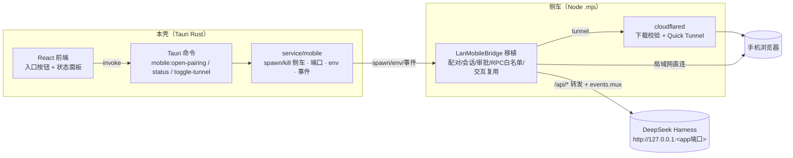

# 手机端远程连接 —— 调研与落地方案（方案 B：原生移动桥）

> 状态：**方案文档（未开始实现）**。基于对两个上游仓库的实地调研，为本桌面壳（Tauri 2 +
> React 18）规划"手机扫码进入 DSH 会话"的原生实现路线。文档只做设计，不改代码。

## 1. 背景与目标

要支持用户在手机上继续 DSH 会话——**无需手机安装 App**，手机浏览器扫码即可。调研对象：

- **SnowfallC/dsh-mobile-web-remote**：一个 DSH Cordis 插件，提供"扫码即用"的远程访问。
- **dataelement/dsh-desktop**（Electron 桌面壳）：**已内置**一套完整的原生手机连接（LAN +
  隧道、桌面审批、RPC 白名单、交互复用），是本方案最主要的参考实现。

本壳当前无任何手机/远程代码。经评审，选用 **方案 B：在桌面壳内实现原生移动桥**，而非直接把
插件装进 profile（A）。理由见 §3。本阶段只产出方案与落地拆解。

## 2. 两种参考实现

### 2.1 插件法（dsh-mobile-web-remote）

- DSH Cordis 插件（`inject: ['webServer']`），装进 **web profile**。
- `cordis.patch.yml` 注入 `mobile-web-remote` 行，配置
  `cloudflaredPath: auto` / `pairingTtlMinutes: 15` / `sessionTtlHours: 12` / `bridgePort: 0`。
- `apply()` 用 `ctx.webServer.register` 挂 `/__dsh_mobile` 管理页、`ctx.webServer.tapIndex`
  注入悬浮「手机远程」按钮（仅 `127.0.0.1/localhost` 宿主显示）。
- 本地反向代理（`http-proxy`，HTTP+WS）转发到 DSH，外层套一次性配对 + 会话 Cookie。
- 用 `cloudflared` 起 **Cloudflare Quick Tunnel**（`*.trycloudflare.com` 临时 HTTPS）。
- **只支持公网隧道，无局域网（LAN）模式**；流量经 Cloudflare 中转（插件自身有安全警告）。
- 特性：复用现有预装插件管线（`resources/preset-plugins.json` + `service/workflow/win_inspector.rs`
  已演示"装插件 + 写 profile `cordis.patch.yml` 挂载行"的完整链路），落地最快；但依赖第三方插件、
  仅公网、无法做桌面审批与 RPC 白名单。

### 2.2 桌面原生桥（dataelement/dsh-desktop，参考实现）

核心文件：

- `src/main/mobile/lan-mobile-bridge.ts`（942 行）：`LanMobileBridge` 类。
- `src/main/mobile/cloudflared-tunnel.ts`（229 行）：cloudflared 下载/校验 + Quick Tunnel spawn。
- `src/main/mobile/lan-mobile-pages.ts`：桌面配对页 + 手机端页面 + 重新连接/等待批准页。
- `src/preload/index.ts`：向 DSH 页面注入「连接手机」悬浮按钮，每秒轮询 `mobile:status`。
- `src/main/index.ts`：`showMobilePairing()`、IPC `mobile:open-pairing`/`mobile:status`、菜单「连接手机…」。
- `src/shared/desktop-menu.ts`、`src/preload/windows-titlebar.ts`：菜单项 `connect-phone`。

关键机制：

| 方面 | 实现 |
|---|---|
| 监听 | 本地 HTTP 服务绑定 `0.0.0.0:<port>`（release `43127`，dev `43128`；可回退随机端口），限制私有/局域网地址（`isPrivateAddress`/`preferredLanAddress`）。 |
| 模式 | `lan`（同 Wi-Fi，用私有地址拼配对 URL）与 `tunnel`（Cloudflare Quick Tunnel，用 `*.trycloudflare.com`）。`requestConnectionMode` 通过回环 + `cf-connecting-ip`/`cf-ray`/`trycloudflare.com` 主机判定。 |
| 配对 | 一次性 pairing token（`randomBytes(32)`，TTL 5min）放在 URL `?token=`；手机访问 `/pair` 后桌面出「批准此手机」请求（`/desktop/pending` + `/desktop/decide`），批准后下发会话 Cookie `dsh_mobile`（`HttpOnly; SameSite=Strict; Max-Age=31536000`）。 |
| 会话 | `sessions`/`suspendedSessions`（token + remoteAddress），支持断开/重连；`/reconnect`、`/pair/retry` 走 `onReconnectRequested`。 |
| RPC | 白名单 `workspace.list`、`agentPreset.list/select`、`session.*`（list/history/models/selectModel/create/prompt/cancel），其余返回 403；经 `forwardRpc` 转发到 `harnessUrl()/api/<method>`（`client-request` 信封，`AbortSignal.timeout(30s)`）。 |
| 交互复用 | `monitorMux` 用 `WebSocket /api/events.mux` 订阅 `server-request`（`question/requested`、`question/resolved`），手机端通过 `/api/rpc` 的 `interaction.pending`/`interaction.answer`/`interaction.cancel` 回答，再 `respondToQuestion` 回 `harnessUrl()/api/respond`。 |
| 页面 | 桌面：`/desktop`（配对/切换模式/审批）；手机：`/pair`（token 后等待批准）、`/pair/status`、`/reconnect`、`/disconnected`、`/api/status`、`/api/rpc`、`/`（手机界面）。 |
| 安全 | CSP `default-src 'self'`；`x-frame-options: DENY`；`robots` 不设；限私有地址；`verifySameOrigin` 校验跨域；host/origin 校正；cookie 严格。 |

> 参考实现把"桌面壳 + DSH"作为**同一 Node 运行时**，主进程直接持有桥与隧道。本壳是 Rust 后端，
> 需要一个适配层。

## 3. 设计决策

### 3.1 选方案 B（原生桥）而非插件法（A）

- **可控性**：可自定义 RPC 白名单、桌面审批流、会话/重连策略，避免把鉴权与转发交给第三方插件。
- **两种连接模式**：插电池有公网隧道，原生桥额外支持同 Wi-Fi 的 LAN 直连（低延迟、不经 Cloudflare）。
- **安全边界**：不下发"添加工作区/设置"等宿主配置给手机，只暴露会话操作；插件法需依赖其内置
  限制注入（`remote-ui.js`），不如白名单彻底。
- **代价**：实现量大、需自维护 cloudflared 与移动页面。用 §3.2 的侧车方式显著降低风险。

### 3.2 关键决策：Node 侧车（首选） vs Rust 原生实现

**推荐：Node 侧车（`.msj`/`.mjs`）+ Rust 编排。**

- 本壳**已捆绑 Node**（`NODE_VERSION` = `v22.22.0`，见
  `src-tauri/src/config/constants.rs`），并已有"spawn 一个 Node 子进程并持有 PID/句柄/杀树"的
  成熟生命周期（`service/workflow`）。
- 参考实现（`LanMobileBridge` + `cloudflared-tunnel` + `lan-mobile-pages`）可近乎 1:1 复用到
  `.mjs`（TS→ESM），把 ~1200 行逻辑直接带走；Rust 只做编排（spawn/端口/IPC/事件）。
- 若纯 Rust 重写，需在 Rust 里重新实现 HTTP 服务器、WS 客户端、RPC 信封、交互复用、二维码、
  cloudflared 下载与 spawn——量大且易与上游行为漂移。
- Node 22 内置全局 `WebSocket`，可直接复用参考实现的 `monitorMux`。

**侧车内依赖**：`qrcode`（生成桌面配对页 SVG）。两种落地：① 侧车目录带一份 `node_modules`
（由本壳 pnpm 安装，见 `service/plugin` 的 pnpm 选版策略）；② 由 Rust 用 `qrcode` crate 生成
SVG 传给侧车（少一个 npm 依赖）。文档倾向于 **①**（与参考实现完全一致、页面在侧车侧渲染），
把 ② 列为备选。

### 3.3 边界划分

- **Rust 侧（`service/mobile`）**：spawn/kill 侧车（记录 PID，退出杀树）、分配/选择端口、
  传递环境变量（DSH 服务 URL、cloudflared 路径/缓存目录、品牌资源路径、区域设置）、暴露 Tauri
  命令（`mobile:open-pairing`、`mobile:status`、`mobile:stop`、`mobile:toggle-tunnel`）、
  监听侧车状态变化并推送前端事件、随 DSH 启停联动。
- **侧车（`.mjs`）**：HTTP 桥服务（配对/会话/审批/RPC 白名单/交互复用/LAN-隧道模式判定/代理）、
  `cloudflared` 的下载校验与 Quick Tunnel spawn、桌面配对页与手机页渲染。它就是参考实现
  `LanMobileBridge` 的移植。
- **前端（React）**：「连接手机 / Manage phone connection」入口（放在本壳导航栏 / 设置面板，
  或沿用 `desktop/style.rs`/`desktop/nav.rs` 已有的向 DSH iframe 注入的能力），打开配对弹窗/窗口，
  展示状态与二维码。i18n 键走 `src/i18n/locales/zh-CN.json`/`en-US.json`（扁平键）。

## 4. 总体架构

数据流要点：

- 侧车拿到 `DSH_WEB_URL`（即本壳服务端口）作为 `harnessUrl`；RPC 转发与交互复用接口同 §2.2。
- 配对成功后下发会话 Cookie `dsh_mobile`；手机后续请求走同一鉴权边界（HTTP 与 WS 共用）。
- 桥端口只在本壳启动「手机连接」时按需创建（懒启动），避免常驻暴露局域网端口；也可参考实现
  在应用启动时预热（eager）。**倾向懒启动**（更贴合本壳"下载即用、默认不联网"的隐私定位）。

## 5. 与本壳现有代码的集成点

- **生命周期**：`src-tauri/src/service/workflow/mod.rs` 的 `launch`/`stop`/`stop_on_exit`
  负责 DSH 子进程。新增 `service/mobile` 在 DSH 就绪后启动侧车，DSH 停止/退出时回收侧车。
- **Tauri 命令注册**：`src-tauri/src/bridge/`（如 `core.rs`）新增 `mobile_*` 命令，并在
  `src-tauri/src/desktop/builder.rs` 的 `generate_handler!` 注册。
- **前端入口**：
  - 导航栏/设置：`src/layout/components/navbar.tsx` 与 `src/components/config-*.tsx` 加入口。
  - 若是独立配对窗口，复用现有 `layout/components/webview.tsx`（WebView 加载 `http://127.0.0.1:<桥端口>/desktop`）。
  - 向 DSH 页面注入按钮：已有 `src-tauri/src/desktop/style.rs`、`desktop/nav.rs` 的先例可复用。
- **i18n**：新增键写入 `src/i18n/locales/zh-CN.json` 与 `en-US.json`（扁平点分键，如
  `mobileRemote.title`、`mobileRemote.connect`、`mobileRemote.manage`、`mobileRemote.scanHint`、
  `mobileRemote.lan`、`mobileRemote.tunnel`、`mobileRemote.approve` 等）。
- **Store**：`src-tauri/src/config/setting.rs` 若需持久化（如上次连接模式、是否启用），需加
  `#[serde(default...)]` 字段并在 `config/mod.rs` 导出。
- **D 依赖/进程**：侧车脚本与最小 `node_modules` 以资源打包；cloudflared 缓存目录建议用
  `$DSH_HOME/cache/dsh-mobile/`（与插件法的 `cache/dsh-mobile-web-remote/` 区分）。

## 6. 安全模型

- 桥绑定 `0.0.0.0` 但**仅接受私有/局域网地址**（LAN 模式）；公网只能走 Cloudflare 隧道（TLS）。
- 一次性配对 token（`randomBytes(32)`）+ 短 TTL；桌面审批（批准/拒绝）后才发会话 Cookie。
- 会话 Cookie `HttpOnly; SameSite=Strict`；`x-frame-options: DENY`、`nosniff`、`referrer-policy: no-referrer`、
  严格 CSP（`default-src 'self'`）。
- **RPC 白名单**：仅 `workspace.list`、`agentPreset.list/select`、`session.*`（读写会话），其余拒绝。
  手机端**不暴露**工作区添加/设置/宿主配置入口。
- cloudflared 下载做 SHA-256 校验与体积上限；只使用官方固定版本；不落盘到系统 PATH。
- 安全提示：Quick Tunnel 为临时公网入口，敏感任务用后即撤销；文档/UI 需提示用户。

## 7. 兼容性验证清单（实现前必须确认）

1. **DSH API 面**：本壳打包的 DSH 是否具备 `POST /api/<method>`（`client-request` 信封）、
   `/api/events.mux`（下行 WS）、`/api/respond`、`settings.describe`？参考实现要求
   `@deepseek-ai/dsh@0.1.1-rc.1`+；本壳 DSH 来自 `dsh-tauri-desk/deepseek-harness-pkg`，需核对版本。
   > 版本核对提示：桌面端 `service/core` 支持多核心槽位与切换（稳定线 `0.1.1-rc.2` 与 alpha 线
   > `0.1.2-alpha.3` 并存）。alpha.3 线重构了客户端运行时（`dsh-client-runtime` 拆分为
   > `dsh-client-store` / `dsh-client-ui-slots` / `dsh-api-*-controller`），但 web 传输面
   > （`/api` 信封 / `events.mux` / `respond` / `settings.describe`）保持不变，`--skip-auth`
   > 两层锚点（`startup.js` + `dsh-client-connection`）在两条线上均命中。侧车桥实现仅依赖
   > 上述 web 传输面即可跨线工作；做能力探测而非硬编码版本号。
2. **Node 版本**：本壳捆绑 `v22.22.0`；侧车需用到全局 `WebSocket`/`fetch`（Node 22+ 满足）。
3. **桥端口**：与 DSH 端口（`DSH_PORT 3080`/`DSH_DEV_PORT 3081`）隔离，避免冲突；参考实现用
   `43127`/`43128`，可沿用并做占用回退。
4. **`0.0.0.0` 绑定权限**：LAN 直连需要监听非回环地址；Windows 防火墙可能弹窗（参考实现同样如此），
   需给出提示或文档说明。
5. **cloudflared**：各平台资产 SHA-256 需与本壳支持的平台（含 `win32-ia32`、`linux-arm` 等
   参考实现未覆盖的平台）核对；必要时手动补充。

## 8. 分级实施计划

实施顺序（每级自包含、可验收）：

**P0 — 方案确认（本次）**：本文档评审通过，锁定侧车路线、RPC 白名单、懒启动策略。

**P1 — 侧车桥骨架（不含隧道）**
- 新增 `src-tauri/resources/mobile/bridge.mjs`（基座）：HTTP 服务 + 配对/会话 + RPC 白名单转发 +
  LAN 模式；含 `qrcode` 依赖。
- 新增 `src-tauri/src/service/mobile/mod.rs`：spawn/kill、端口、env、事件。
- `bridge/core.rs` 注册 `mobile:status`、`mobile:open-pairing`、`mobile:stop`。
- 前端入口 + i18n（连接/状态/二维码）。
- 验收：同 Wi-Fi 手机扫码 → 桌面批准 → 手机进入会话。

**P2 — Cloudflare Quick Tunnel 模式**
- 移植 `cloudflared-tunnel.ts`（下载校验 + spawn）；`mobile:toggle-tunnel`。
- 隧道模式配对 URL = `*.trycloudflare.com/pair?token=...`。
- 验收：手机走 4G/5G 或异网可连；打印/展示隧道地址与到期时间。

**P3 — 交互复用与边界**
- 移植 `monitorMux`（`/api/events.mux`）与 `interaction.*` 回答链路。
- 限流/超时/重连、`onReconnectRequested` 回落。
- 验收：手机端可回复 agent 的提问（question/answer）。

**P4 — 加固与收尾**
- RPC 白名单扩充评审；CSP/头部防 XSS；会话/令牌轮换；断开与撤销。
- 主题/语言跟随（读 DSH `settings.describe`、`/api/events.mux` 主题）。
- 测试（Rust 单测 + 手动/自动化用例，参考 `docs/testing` 目录风格）；README 增补。

## 9. 风险与开放问题

- **工作量**：侧车移植是主项（~1200 行 + 页面），P1–P3 跨多个迭代；若嫌重，可折中先用插件法
  快速上线（A），再渐进替换为原生桥（B）。
- **第三方依赖（qrcode）**：需随侧车打包/安装，带来供应链与版本管理；可换成 Rust 生成二维码。
- **公网暴露**：Quick Tunnel 流量经 Cloudflare 中转、域名临时；务必叠加白名单 + 短 TTL + 会话撤销，
  UI 需显著提示。
- **局域网模式防火墙**：Windows 可能弹防火墙授权；需引导用户允许，或默认走隧道。
- **DSH API 漂移**：DSH 演进可能改 `events.mux`/RPC 信封；兼容性 CI（参考实现每周跑 DSH main）
  值得复刻，或在本壳更新 DSH 后跑一遍回归。
- **端口占用**：`43127/43128` 被占时需回退；与 DSH 端口漂移逻辑一致。
- **开放问题**：
  1. 桥端口与配对是否**常驻**（eager）还是按需（lazy）？本方案倾向 lazy，是否接受？
  2. 侧车 `node_modules`（qrcode）随包安装，还是 Rust 生成二维码？
  3. 桌面审批页：独立 Tauri 窗口，还是主窗口内嵌 iframe/弹窗？
  4. 是否需要局域网直连？还是仅隧道即可（可大幅缩小实现面）？
  5. 侧车脚本与 cloudflared 是否随 DSH 核心更新，还是独立版本管理？

## 10. 相关参考文件

- 插件法：`https://github.com/SnowfallC/dsh-mobile-web-remote`（`src/`、`cordis.patch.yml`）。
- 原生桥参考：`https://github.com/dataelement/dsh-desktop`
  （`src/main/mobile/lan-mobile-bridge.ts`、`cloudflared-tunnel.ts`、`lan-mobile-pages.ts`、
  `src/preload/index.ts`、`src/main/index.ts`）。
- 本壳内先例：`src-tauri/src/service/workflow/win_inspector.rs`（插件装后写 profile
  `cordis.patch.yml` 挂载行的完整范式）；`src-tauri/src/service/workflow/mod.rs`（子进程生命周期）。
