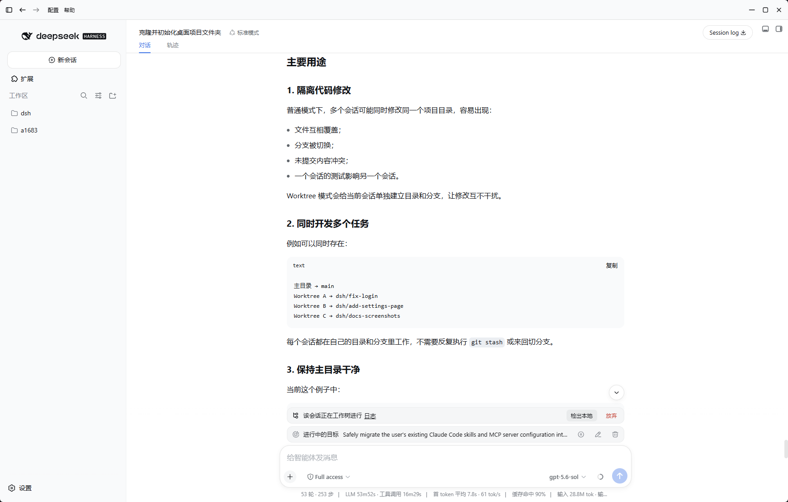

# dsh-tauri-worktree

`dsh-tauri-worktree` 为 DSH 会话提供 Git worktree 隔离。每个工作树会话拥有独立目录，Agent 可以安全地修改代码，而不会影响本地主工作区。



## 功能

- 按项目路径和会话 ID 创建稳定、可复用的隔离工作树。
- 注册 `create_worktree`、`checkout_worktree` 工具。
- `create_worktree` / `checkout_worktree` 支持可选 `carry_staged` 参数（默认 `false`）：把已暂存（index）改动携带进新工作树、或携带回本地检出，避免暂存内容在隔离/移除工作树时丢失。
- 提供创建、状态、检出和放弃 API：`/api/dsh-worktree/*`。
- 将工作树状态注入系统提示：`is_worktree: true`。
- 检出时创建或切换本地分支，并带回完整会话历史。
- 放弃工作树时清理临时分支和 ledger 记录。

## 携带暂存（carry_staged）

git worktree 的 index 与暂存状态是每个工作树私有的：`git worktree add` 始终从本地 `main` 分支干净检出，
未提交改动不会跟随；移除工作树时未提交改动也随之删除。为避免「有暂存时创建/检出工作树
导致内容丢失」，两个工具都提供开关：

```ts
// 创建时把源仓库已暂存改动带入新工作树（不携带未暂存/未跟踪改动）
create_worktree({ branch_name: 'dsh/feature-xyz', carry_staged: true })

// 检出时把工作树已暂存改动带回本地分支，再移除工作树
checkout_worktree({ worktree_hash_dirname: '[hash]/[dirname]', branch_name: 'dsh/feature-xyz', carry_staged: true })
```

语义说明：

- `carry_staged` 只移动「已暂存（index）」状态：修改、新增、删除的暂存条目会在目标目录
  重建为同样的暂存状态（文件内容同步到 index，`git status` 分布一致）。
- 未暂存与未跟踪改动按 git worktree 的设计不携带：创建时留在源仓库，检出时随工作树移除。
- 实现基于 `git diff --cached --binary` + `git apply --cached`，只触碰补丁涉及的路径，
  不使用仓库级共享的 `git stash`，避免跨 worktree 污染 stash 列表或覆盖目标目录无关改动。
- 创建时始终以本地 `refs/heads/main` 为内容来源；若该分支不存在或无法解析，创建会在执行 worktree 操作前明确失败。
- 创建时携带失败会回滚刚创建的工作树；检出时携带失败会回滚到检出前分支并保留工作树。

## 可靠删除（junction 安全）

放弃/检出会移除工作树目录。Git for Windows 旧版本递归删除时会跟随 NTFS junction，
误删 junction 目标内容，因此磁盘删除绝不交给 Git：

1. （可选）先终止仍以工作树为 cwd 的进程：宿主把该能力注册为 ctx 服务后，插件经
   `ctx.get('worktreeProcessController')` 探测并按「探测后调用」约定读取
   `stopSessionProcesses`；未注册即跳过（公共 DSH API 暂无按会话停止进程的能力）。
   注意宿主 ctx 是 cordis 代理，未注入的属性直接读取会抛
   `cannot get property ... without inject`，因此探测失败或控制器异常都不会中断删除。
2. 目录重命名到同卷 `<worktreesRoot>/.trash/[hash]/[dirname]` 后用
   `fs.rm({ recursive, force, maxRetries: 10, retryDelay: 100 })` 删除；重命名失败
   （跨卷/句柄占用）时退回直接 `fs.rm`，外层再重试 3 次（间隔 2s）。
3. 目录删除后顺带移除因此变空的 `worktrees/[hash]` 与 `.trash/[hash]` 容器目录
   （`rmdir` 仅对空目录生效，非空/不存在时静默跳过），避免每次放弃/检出都在
   `<worktreesRoot>` 下残留一个空 `<hash>` 文件夹；收尾为尽力而为，失败不影响删除结果。
4. `git worktree prune --expire now` 只清理 Git 管理记录；之后才删除本插件拥有的
   `dsh/*` 分支。任一步失败都会保留绑定（ledger），可通过再次放弃/重试收敛。
5. 残留状态收敛：目录-only（中断遗留）在 `ensureWorktree` 重建前被 fs 删除；管理记录-only
   在创建前被 prune；两者共存时拒绝覆盖已注册但缺少绑定的完整工作树。

## 异步放弃（discard job）

- `POST /discard` 立即返回 `{ ok, jobId }`，后台执行删除；同一会话/工作树的重复请求去重。
- `GET /status` 在删除期间返回 `mode: 'deleting'`、失败返回 `mode: 'failed'`（含 error 与
  worktreeKey/path），完成后回落到常规 status 语义。
- 客户端乐观标记 `deleting` 并轮询直至收敛；归档会话的清理在请求失败/任务失败时清除
  去重标记，等待下次快照重试。

## 用户流程

1. 用户明确要求使用 worktree 后，Agent 调用 `create_worktree`。
2. 插件创建 `~/.dsh/worktrees/[hash]/[dirname]`，并把会话交接到新工作树。
3. 在工作树会话中修改、测试和提交代码。
4. 用户明确请求或批准后，才能调用 `checkout_worktree`；该操作会把改动带回本地分支并移除工作树。
5. 如果不需要保留改动，可从面板执行放弃操作。

> `checkout_worktree` 是用户授权操作。任务完成、PR 合并或 Agent 的便利性都不能代替用户授权。

## 要求

- 项目目录必须是 Git 仓库。
- 宿主环境需要可执行的 `git`。
- 插件需要 DSH 的 tools、systemPrompt、webServer、sessions、workspaceRegistry 和 agents 服务。

## 许可证

[MIT](../../LICENSE.md) © [Hairyf](https://github.com/hairyf)
